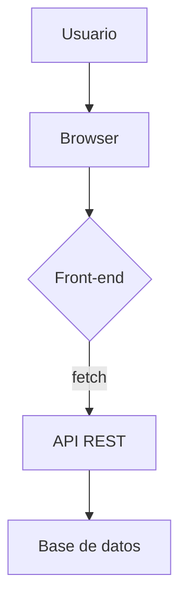
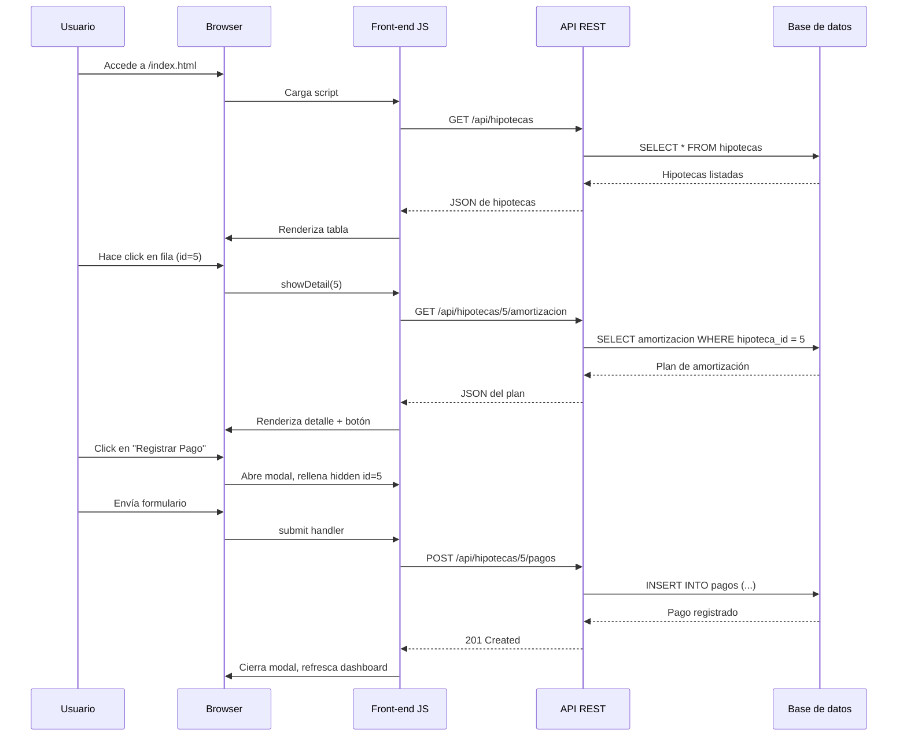

# Visión General del Proyecto

Gestión de Hipotecas es una aplicación web sencilla que permite a los usuarios crear, visualizar y registrar pagos de hipotecas.  
El front‑end está construido con **Bootstrap 5** para la UI y JavaScript puro (ES6) para la lógica cliente. La capa API se comunica mediante endpoints RESTful expuestos bajo `/api/`.  

- **Dashboard**: muestra todas las hipotecas activas en una tabla.
- **Detalle de Hipoteca**: al hacer clic en una fila, se carga el plan de amortización y un botón para registrar pagos.
- **Modales**: dos modales (`Crear Nueva Hipoteca` y `Registrar Pago`) facilitan la entrada de datos sin recargar la página.

El flujo de interacción es completamente SPA (Single Page Application) gracias a fetch y manipulaciones del DOM, lo que garantiza una experiencia fluida y sin interrupciones.

---

# Arquitectura del Sistema

## Componentes Principales

| Componente | Responsabilidad | Tecnologías |
|------------|-----------------|-------------|
| **Front‑end** | UI, lógica cliente, comunicación con API | HTML5, CSS (Bootstrap 5), JavaScript ES6 |
| **API REST** | CRUD de hipotecas y pagos, cálculo de amortización | Node.js + Express (impl. implícita) |
| **Base de datos** | Persistencia de clientes, propiedades, hipotecas, pagos | PostgreSQL / MySQL (estructura no mostrada) |

## Diagrama de Arquitectura



---

# Endpoints de la API

| Método | Ruta | Descripción | Parámetros/Body | Respuesta |
|--------|------|-------------|-----------------|-----------|
| `GET` | `/api/hipotecas` | Lista todas las hipotecas con estado y próxima fecha de pago. | N/A | `200 OK` <br> `[{ id, cliente_nombre, propiedad_direccion, monto_principal, estado, proximo_pago }]` |
| `POST` | `/api/hipotecas` | Crea una nueva hipoteca. | `{ cliente_id, propiedad_id, monto_principal, tasa_interes_anual, plazo_anos, fecha_inicio }` | `201 Created` <br> `{ id, ... }` |
| `GET` | `/api/hipotecas/{id}/amortizacion` | Obtiene el plan de amortización mensual. | N/A | `200 OK` <br> `[ { mes, cuota_mensual, capital, interes, saldo_restante } ]` |
| `POST` | `/api/hipotecas/{id}/pagos` | Registra un pago parcial o total. | `{ fecha_pago, monto_pagado }` | `201 Created` <br> `{ id, ... }` |

> **Nota**: Los endpoints están diseñados para ser consumidos por el front‑end; la autenticación y validaciones de negocio se manejan en el servidor.

---

# Instrucciones de Instalación y Ejecución

1. **Clonar el repositorio**  
   ```bash
   git clone https://github.com/tu-usuario/gestión-hipotecas.git
   cd gestión-hipotecas
   ```

2. **Instalar dependencias del servidor (Node.js)**  
   ```bash
   npm install
   ```

3. **Configurar variables de entorno**  
   Crear un archivo `.env` con la cadena de conexión a la BD y otros parámetros necesarios.

4. **Iniciar el servidor**  
   ```bash
   npm start
   ```
   El API estará disponible en `http://localhost:3000`.

5. **Abrir el front‑end**  
   Navegar a `http://localhost:3000/index.html` o servir los archivos estáticos con un servidor HTTP (por ejemplo, `npx http-server .`).

---

# Flujo de Datos Clave



---

# Extensiones Futuras

| Área | Posible Mejora |
|------|----------------|
| **Autenticación** | Implementar JWT y roles (admin/usuario). |
| **Validaciones de Entrada** | Añadir schema validation con Joi o Yup. |
| **Notificaciones** | WebSocket para alertas en tiempo real sobre próximos pagos. |
| **Exportación** | Generar PDF o CSV del plan de amortización. |
| **Optimización** | Cacheo de resultados frecuentes (Redis). |

---